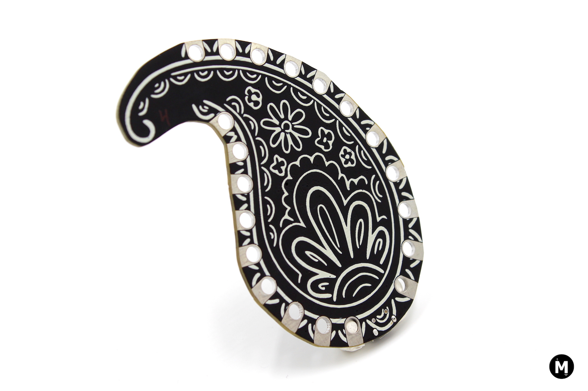

# ButaBoard
This repo contains all the necessary design, fabrication files and example codes for the ButaBoard development board. ButaBoard is highly inspired by the [Adafruit Circuit Playground Classic](https://www.adafruit.com/product/3000) with some minor hardware changes. Additionaly, the paisley patterned styling and ornamental touches make this board more suitable for wearables. 

## Specs:
- ATmega32u4 MCU, running @3.3V, 8MHz
- 32KB Flash, 2.5 KB SRAM, 1KB EEPROM
- IO pins: 14 (Crocodile clip-4mm Banana pads)
- Dimenions: ~94x61x5 mm

### ButaBoard v1

 This work is licensed under a <a rel="license" href="http://creativecommons.org/licenses/by-nc-sa/4.0/">Creative Commons Attribution-NonCommercial-ShareAlike 4.0 International License</a>.

